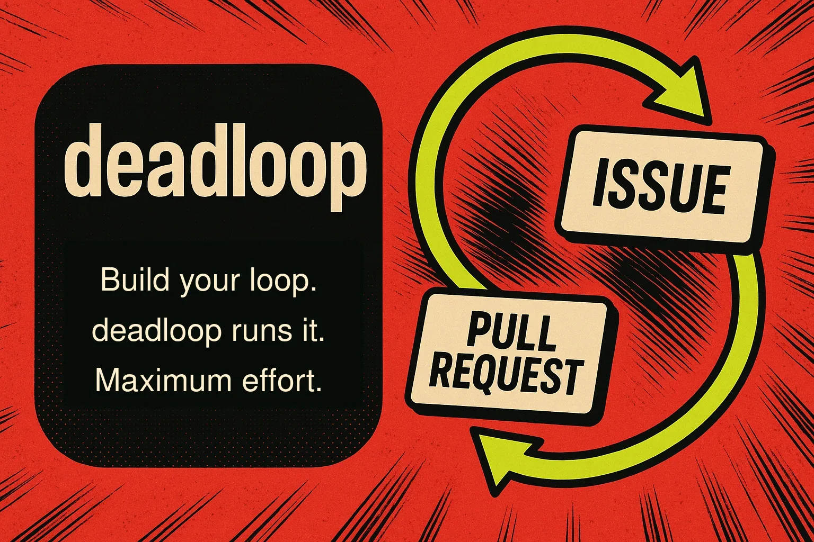
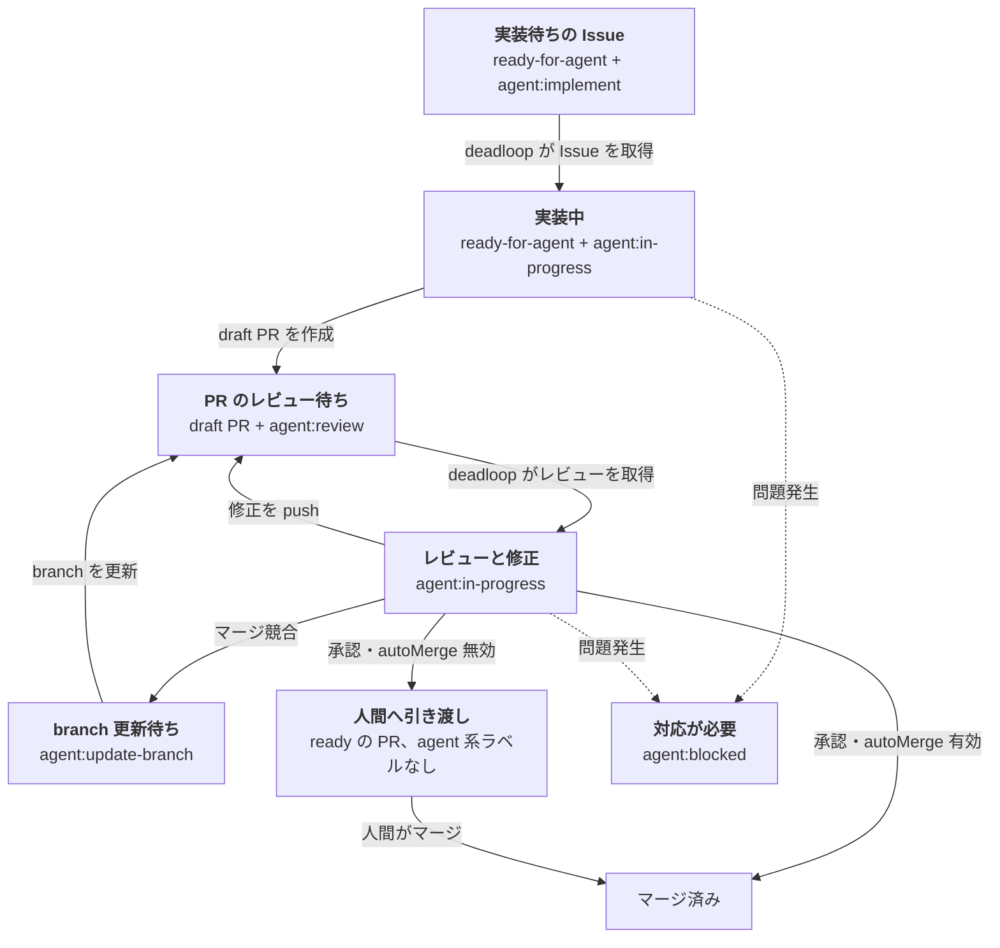

[English](README.md) | 日本語

# deadloop

> ループを作るのはあなた。回すのは deadloop。頑張っちゃうぞ。

**GitHub Issue から、レビュー済みの PR へ。** deadloop は Issue を監視し、実装、PR 作成、レビュー、マージを、安全装置付きで自動化します。

## インストール

Pi パッケージをインストールします。

```bash
pi install git:github.com/yasuhito/deadloop
```

このコマンドで、deadloop の拡張と設定用スキルがまとめてインストールされます。

## 現在の状態

- v0 は Pi パッケージ／拡張として動作します。
- 既定の実行基盤は [Herdr](https://herdr.dev/) です。
- 現在対応しているホスト環境は、互換性のある `flock` 実行ファイル（通常は util-linux が提供）と、非待機のファイル記述子ロックを利用できる Unix 系システムです。`/deadloop-enable` は自動処理を有効化する前に、この機能を検査します。

## 設定

認証済みの `gh` CLI と、起動中の [Herdr](https://herdr.dev/) 0.8.0 以上のサーバーを用意してください。

1. 通常の Git チェックアウトから Pi を起動します。

   ```bash
   cd /absolute/path/to/your/repo
   pi
   ```

2. deadloop を有効化します。

   ```text
   /deadloop-enable
   ```

3. deadloop に任せる Issue に、次のラベルを両方付けます。

   - `ready-for-agent`
   - `agent:implement`

これだけで利用を開始できます。有効化すると、deadloop は `npm run check` を実行し、不足している標準ラベルを作成して、自動マージを無効にした状態で動き始めます。リポジトリに `npm run check` スクリプトがない場合は、[詳細設定](#詳細設定)に従って `deadloop.json` に別の `checkCommand` を指定してください。

## ラベルでループを制御する

Issue にラベルを付けると、ループが始まります。実装中とレビュー中の状態は deadloop が管理し、承認後は方針に従って PR を人間へ引き渡すか、自動でマージします。



1. **実装を依頼する** — `ready-for-agent` は、エージェントが対応できる Issue であることを示します。`agent:implement` を付けると実装を依頼できます。deadloop が Issue を取得する前に `agent:implement` を外すと、依頼を取り消せます。
2. **deadloop に任せる** — deadloop は依頼ラベルを `agent:in-progress` に置き換え、`agent:review` を付けた draft PR を作成します。必要に応じて、レビューと修正を繰り返します。PR の作業は要求ラベルだけが待ち行列になり、`agent:update-branch`、`agent:implement`、`agent:review` の順に一度に 1 件ずつ処理されます。
3. **完了または対応する** — 承認された PR は、自動マージが無効なら ready へ変わり agent 系ワークフローラベルが外れます。有効ならマージされます。`ready-for-human` は Issue の分類用ラベルであり、PR には付きません。`agent:blocked` が付くとループは止まり、止まった PR には agent への要求が 1 つも残りません。Issue または PR のコメントに記載された原因を解消し、次に実行したい役割の要求ラベルを追加してください。`agent:blocked` はその試行が始まった時点で消えます。

## 運用コマンド

対象リポジトリで起動した Pi セッションから、次のコマンドを実行できます。

| コマンド | 用途 |
| --- | --- |
| `/deadloop-enable` | リポジトリを検証し、deadloop が新しい作業を開始できるようにします。 |
| `/deadloop-disable` | 新しい作業の開始を止めます。実行中の試行は完了することがあります。 |
| `/deadloop-status` | deadloop が有効かどうかと、現在の状態の概要を表示します。 |
| `/deadloop-doctor` | 設定や保持された試行を変更せずに診断します。 |
| `/deadloop-abandon-attempt <attempt-id>` | doctor に表示された場合だけ、保持された試行を安全に放棄します。 |

## 詳細設定

既定の検証コマンドは `npm run check` です。別のコマンドを使う場合は、リポジトリの基準ブランチへ `deadloop.json` をコミットします。

```json
{
  "checkCommand": "your verification command"
}
```

標準の設定では、ローカル設定ファイルは不要です。`autoMerge`、ワークツリー保存先、信頼済みの別の自動処理ホストなどを上書きする場合だけ作成します。

```bash
mkdir -p ~/.pi/agent/deadloop
cp ~/.pi/agent/git/github.com/yasuhito/deadloop/extensions/deadloop/projects.example.json ~/.pi/agent/deadloop/projects.json
$EDITOR ~/.pi/agent/deadloop/projects.json
```

`projects.json` にはローカルのパスや運用設定が含まれます。リポジトリにはコミットしないでください。共有してレビューする方針は、リポジトリ内の `deadloop.json` に記載することを推奨します。

実装 Issue が必須検証停止になった場合、deadloop は `ready-for-agent` を残し、実装用の進行ラベルを外して、理由別の復旧案内とともに `agent:blocked` を付けます。同じ復旧内容の案内は重複させず、設定変更だけでは再投入しません。必須検証が解決した後に限り、`/deadloop-doctor` が対象 Issue の再投入コマンドを表示します。

## 安全装置

`autoMerge` は、レビュー済みの PR を deadloop が自動的にマージするかを制御します。

`false` では、PR の作成とレビューまでを自動化し、マージは人間に引き渡します。

`true` では、安全条件を満たした PR を squash merge し、作業ブランチを削除します。

最初は `false` に設定してください。ブランチ保護、CI、権限、停止条件を確認してから `true` にします。

## マージ競合の自動修復

ブランチの自動更新は、現在利用できません。deadloop はマージ競合を検出しますが、`agent:update-branch` ラベルによる依頼を作業エージェントへ接続する #241 が完了するまでは、ブランチを更新しません。非 force、先頭コミットの厳密一致、必須検証、通常 merge の安全契約は引き続き必要です。

以下は、今後この処理を接続するときの安全契約であり、現在実行できる動作の説明ではありません。

作業エージェントは、選択された基準コミットを既存の PR ブランチへマージします。rebase は行いません。

作業エージェントは、設定済みの検査を実行します。PR の先頭が検証済みコミットと一致する場合だけ、ブランチを不可分に更新して通常のレビューへ戻します。

更新中もレビュー用ラベルを維持します。追加のラベルは不要です。

同じ PR の先頭コミットと基準側の先頭コミットの組み合わせに対する試行は、一度だけです。

PR の先頭コミットが変わっていた場合は、push せずに停止します。deadloop は次の周期で PR を再評価します。

更新に失敗した場合や安全を確認できない場合は、復旧情報とともに `agent:blocked` を付け、agent への要求は 1 つも残しません。

安全契約については [ADR 0011](docs/adr/0011-pr-merge-conflict-recovery.md) を参照してください。

## レビュー指摘の自動修正

組み込みのレビューエージェントが構造化された修正可能な指摘を返すと、deadloop は既存の PR ブランチで、一度だけ専用の修正用作業エージェントを起動できます。

修正中は、`agent:in-progress` を維持し、別の作業状態ラベルは追加しません。修正完了までは新しい `agent:review` 要求を作りません。

作業エージェントには、指摘事項だけを渡します。

最終処理では、変更したファイル数にかかわらず、すべての修正で設定済みの検査を実行します。対象ブランチの先頭が検証済みコミットと一致する場合だけ、そのブランチを不可分に更新します。

別の先頭コミットを置き換えたり、GitHub の作業状態を変更したりはしません。

レビュー結果は、読みやすい PR コメントとして記録します。コメントには、対象コミット、判断理由、指摘事項、次の操作を記載します。

各レビューは、PR のコミット列、正確な差分、会話コメント、送信済みレビュー、行コメントを全ページ取得した観測結果にも結び付けます。追加、編集、削除、head または base の変更、差分の変更があれば、PR を新しいレビュー要求へ戻します。コメント本文は、信頼できない証拠としてのみ扱います。

修正の push を確認した後は、結果を別のコメントに記録します。コメントには、指摘ごとの変更内容、新しいコミット、検査結果、再レビューへの引き渡しを記載します。

先頭コミットが変わっていた場合や修正に失敗した場合は、成功コメントを投稿しません。

先頭コミットが変わると、新しいレビュー周期が始まります。

先頭コミットがすでに変わっていた場合は、push もラベル変更も行わずに停止します。

上限付きの試行後も同じ指摘が残った場合は、復旧情報とともに `agent:blocked` を付け、要求ラベルを全て外します。技術上または安全上の再試行を使い切った場合も同様です。人間の判断が必要だと報告したレビューは完走したレビューとして扱い、結果を記録したうえで draft を ready へ変え、agent 系ワークフローラベルを全て外します。PR は人間を待つ状態になり、agent への要求は残りません。

詳しくは [ADR 0012](docs/adr/0012-automatic-pr-review-repair.md) を参照してください。

## 段階的に導入する

1. **Issue の調整のみ** — 慎重に導入したい場合は、ここから始めます。PR のレビューとマージは人間が行います。
2. **PR の自動レビュー** — 標準の PR レビューを `autoMerge: false` で使用します。承認された PR は ready になり agent 系ワークフローラベルが残らないので、そこから先は人間が引き取ります。外部レビューの変更処理は現在利用できません。`externalReview` を有効にしても利用可能にはなりません。
3. **任意の自動マージ** — ブランチ保護、CI、レビュー要件、dry-run または人間による承認手順、停止条件が十分に実証されてから、`autoMerge: true` を検討してください。

## ドキュメント

- Herdr runner の詳細: [docs/herdr-runner.md](docs/herdr-runner.md)

## このリポジトリを検証する

実行可能な受け入れ仕様は [`acceptance/features/`](acceptance/features/) にあります。

問題を調べる際は、Vitest と Cucumber を個別に実行できます。`npm test` は常に両方を直列に実行します。

```bash
npm run test:unit
npm run test:acceptance
npm test
npm run lint
npm run typecheck
bash -n extensions/deadloop/automations/*.sh
npm pack --dry-run
npm run check
```
