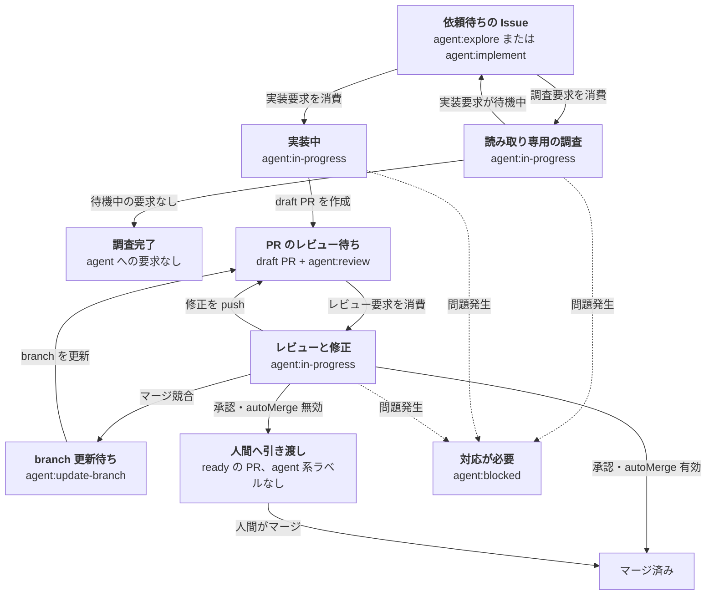

[English](README.md) | 日本語

# deadloop

> ループを作るのはあなた。回すのは deadloop。頑張っちゃうぞ。

**GitHub Issue から、レビュー済みの PR へ。** deadloop は Issue を監視し、実装、PR 作成、レビュー、マージを、安全装置付きで自動化します。

## インストール

Pi パッケージをインストールします。

```bash
pi install git:github.com/yasuhito/deadloop
```

このコマンドで、deadloop の拡張と設定用スキルがまとめてインストールされます。

## 現在の状態

- v0 は Pi パッケージ／拡張として動作します。
- 自動処理のホストは Pi と [omp](https://github.com/oh-my-pi/pi-coding-agent)（Oh My Pi）のどちらでも使えます。ホスト固有の設定はなく、どちらでも同じように読み込まれて自動処理が動きます。1 つのリポジトリを同時に駆動するのは 1 ホストだけです。スケジューラのロックは GitHub リポジトリ ID を単位とするため、後から起動した側は駆動せず、先に起動した側が続けます。
- 作業担当とレビュー担当は `pi`、`claude`、`omp` から選べます。`workerAgent` と `reviewerAgent` で指定し、どのホストが自動処理を動かしているかとは独立です。
- 既定の実行基盤は [Herdr](https://herdr.dev/) です。
- 現在対応しているホスト環境は、互換性のある `flock` 実行ファイル（通常は util-linux が提供）と、非待機のファイル記述子ロックを利用できる Unix 系システムです。`/deadloop-enable` は自動処理を有効化する前に、この機能を検査します。
- 各 Automation host は、拡張の読み込み時に deadloop checkout の commit をコード識別子として固定します。checkout が進んだ場合、共有 enablement 状態の書き込みと tick は operator が `/reload` を実行するまで停止します。status と doctor は引き続き利用でき、両方の識別子と復旧手順を表示します。共有 enablement 状態には診断専用として最後の書き込み元のコード識別子が記録され、`/deadloop-doctor` がそれに加えてコードスナップショットの在庫（世代数と容量）と掃除コマンドを報告します。スナップショットを自動で削除することはありません。

## 設定

認証済みの `gh` CLI と、起動中の [Herdr](https://herdr.dev/) 0.8.0 以上のサーバーを用意してください。

1. 通常の Git チェックアウトから Pi を起動します。

   ```bash
   cd /absolute/path/to/your/repo
   pi
   ```

2. deadloop を有効化します。

   ```text
   /deadloop-enable
   ```

3. 実装を依頼する場合は `agent:implement`、読み取り専用の調査を依頼する場合は `agent:explore` を Issue に付けます。`ready-for-agent` は任意のトリアージ情報です。両方の依頼がある場合は調査が優先され、結果が Issue に投稿されてから実装が始まります。

これだけで利用を開始できます。有効化は高速な事前確認だけを行い、リポジトリのテストは実行しません。不足している標準ラベルを作成し、自動マージを無効にした状態で動き始めます。テストは必須検証として、作業結果のpush・引き継ぎ・マージの前に実行されます。既定の検証コマンドは `npm run check` です。リポジトリにこのスクリプトがない場合は、[詳細設定](#詳細設定)に従って `deadloop.json` に別の `checkCommand` を指定してください。

## ラベルでループを制御する

Issue にラベルを付けると、ループが始まります。調査、実装、レビューの状態は deadloop が管理し、承認後は方針に従って PR を人間へ引き渡すか、自動でマージします。



1. **作業を依頼する** — `agent:explore` は読み取り専用の調査を依頼し、`agent:implement` より優先されます。`agent:implement` は実装を依頼します。`ready-for-agent` は任意のトリアージ情報です。deadloop が選択した要求世代を消費する前に要求ラベルを外すと、依頼を取り消せます。
2. **deadloop に任せる** — deadloop は試行を永続化し、選択した要求の消費と `agent:in-progress` の作成を 1 つの検証済み遷移として行ってから、調査担当または Worker を起動します。1 つの Issue で動く試行は 1 つだけで、同時なら調査が優先されます。調査と実装が同時に消費された場合、起動するのは調査だけで、`agent:implement` は戻されます。実装は調査結果が使えるようになった後の試行として待機し、その旨をコメントで説明します。人が何かする必要はありません。調査が成功すると、待機中の実装要求を消さずに結果を投稿します。実装では `agent:review` を付けた draft PR を作成し、必要に応じてレビューと修正を繰り返します。PR の作業は要求ラベルだけが待ち行列になり、`agent:update-branch`、`agent:implement`、`agent:review` の順に一度に 1 件ずつ処理されます。
3. **完了または対応する** — 承認された PR は、自動マージが無効なら ready へ変わり agent 系ワークフローラベルが外れます。有効ならマージされます。`ready-for-human` は Issue の分類用ラベルであり、PR には付きません。`agent:blocked` が付くとループは止まります。調査が失敗した場合や安全を確認できない場合、停止より前の要求は消去され、停止後に追加された要求は復旧の入口として残ります。通常、止まった PR には agent への要求が残りません。必須検証による停止だけはレビュー対象を示す `agent:review` を残しますが、その要求イベントは停止より前なので作業を再開しません。コメントに記載された原因を解消し、必須検証の解決後は `/deadloop-doctor` を使うか、次に実行したい役割の要求ラベルを追加してください。`agent:blocked` はその試行が始まった時点で消えます。
4. **依存を Issue 本文で宣言する** — `## Blocked by`（または `Depends on`）セクションがあると、選定はその依存で止まります。裸の `#123` やこのリポジトリ自身へのリンクは、対象 Issue が閉じるまで選定を妨げます。存在しない番号も fail closed で妨げ、理由を Issue のコメントで報告します。別リポジトリの Issue への参照（リンクや `owner/repo#123`）は依存として数えません。deadloop はリポジトリ単位で動くためです。

## 運用コマンド

対象リポジトリで起動した Pi セッションから、次のコマンドを実行できます。

| コマンド | 用途 |
| --- | --- |
| `/deadloop-enable` | 高速な事前確認を行い、deadloop が新しい作業を開始できるようにします。 |
| `/deadloop-disable` | 新しい作業の開始を止めます。実行中の試行は完了することがあります。 |
| `/deadloop-status` | deadloop が有効かどうかと、現在の状態の概要を表示します。 |
| `/deadloop-doctor` | 設定や保持された試行を変更せずに診断します。 |
| `/deadloop-abandon-attempt <attempt-id>` | doctor に表示された場合だけ、保持された試行を安全に放棄します。 |

## 詳細設定

既定の検証コマンドは `npm run check` です。別のコマンドを使う場合は、リポジトリの基準ブランチへ `deadloop.json` をコミットします。

```json
{
  "checkCommand": "your verification command"
}
```

標準の設定では、ローカル設定ファイルは不要です。`autoMerge`、ワークツリー保存先、信頼済みの別の自動処理ホストなどを上書きする場合だけ作成します。

```bash
mkdir -p ~/.pi/agent/deadloop
cp ~/.pi/agent/git/github.com/yasuhito/deadloop/extensions/deadloop/projects.example.json ~/.pi/agent/deadloop/projects.json
$EDITOR ~/.pi/agent/deadloop/projects.json
```

`projects.json` にはローカルのパスや運用設定が含まれます。リポジトリにはコミットしないでください。共有してレビューする方針は、リポジトリ内の `deadloop.json` に記載することを推奨します。

実装 Issue が必須検証停止になった場合、deadloop は無関係なトリアージ用ラベルを残し、実装要求または進行中を示すラベルを外して、理由別の復旧案内とともに `agent:blocked` を付けます。同じ復旧内容の案内は重複させず、設定変更だけでは再投入しません。必須検証が解決した後に限り、`/deadloop-doctor` が対象 Issue の再投入コマンドを表示します。

レビューが必須検証で停止した場合、修正が必要な指摘は記録しますが、修復担当は起動せず、指摘のない結果を承認として記録しません。`agent:review` を残し、`agent:in-progress` を外して `agent:blocked` を付けます。`ready-for-human` は付けません。同じ復旧内容の停止コメントは重複させず、設定変更だけでは再投入しません。必須検証が解決した後に限り、`/deadloop-doctor` が PR 固有の再投入コマンドを表示します。

## ワークフロー状態は GitHub 上だけにあります

Issue / PR の状態、head、ラベル、コメント、checks が唯一のワークフロー状態です。要求ラベル（`agent:explore`、`agent:implement`、`agent:review`、`agent:update-branch`）は一回限りのイベントです。ラベルを付けた一つひとつのイベントがその役割の試行を一度だけ依頼し、deadloop は作業開始前にそのラベルだけを外して消費します。再試行や追加の依頼は、同じ要求ラベルをもう一度付けることだけで表せます。`agent:in-progress` は消費されて動いている仕事、`agent:blocked` は停止を示し、停止した対象が停止より前の要求を持つことはありません。

1 つのリポジトリを同時に駆動するのはリポジトリ ID 単位のロックで守られた 1 ホストだけですが、複数のマシンや identity が 1 つのリポジトリを担当できます。誰が仕事を所有しているかは公開タイムラインから同じように導かれるため、どのホストも同じ結論に達します。試行が時間切れになった場合、ホストが落ちた場合、安全を証明できない場合は、対象は人間が読める理由とともに `agent:blocked` へ移ります。人が新しい要求ラベルを追加するまで、自動では何も再開しません。`/deadloop-doctor` はローカル向けの手順ではなく、そのコマンドを表示します。

このモデルは Matt Pocock の Sandcastle dogfood workflow を基調とします（調査記録は [docs/research/matt-pocock-sandcastle-github-state-model.md](docs/research/matt-pocock-sandcastle-github-state-model.md)）。ただし deadloop は安全のための違いを意図的に保ちます。検証済み head に厳密に束縛した非 force push、push・引き渡し・マージ前の必須検証、毎 tick の古い状態との照合、複数ホスト間での claim 導出です。判断の詳細は [ADR 0032](docs/adr/0032-github-is-the-workflow-state-source-of-truth.md) を参照してください。

## 安全装置

`autoMerge` は、レビュー済みの PR を deadloop が自動的にマージするかを制御します。

`false` では、PR の作成とレビューまでを自動化し、マージは人間に引き渡します。

`true` では、安全条件を満たした PR を squash merge し、作業ブランチを削除します。

必須検証が未実施または失敗していても、レビュー担当は修正要求や人間の判断が必要という結果を記録できます。承認、合格としての人間への引き渡し、マージ候補への追加には、現在の PR head に対してホストが記録した必須検証の成功が必要です。エージェントが報告した検証結果は追加情報としてのみ扱います。

最初は `false` に設定してください。ブランチ保護、CI、権限、停止条件を確認してから `true` にします。

PR レビュー、ブランチ更新、レビュー修復の試行監視には、Automation host のモデルを使いません。実行基盤が作業中と報告している間は出力が途切れても継続し、設定済みの24時間上限を実作業時間へ適用します。完了報告がないままターンが終わっても、会話で完了報告を催促しません。

レビューの停止を実行基盤が確認したら、記録の前に完了報告をもう一度読み直し、その停止を選定時の PR head と試行に結び付けて PR 上に表示します。`ENOSPC` や `EDQUOT` のせいで完了報告ファイル自体を読めなかった停止は容量不足停止として記録し、空き容量を確保する復旧手順を案内します。pane の文字列だけではこの原因をつけません。どちらの失敗も上限付きの技術的再試行に入らず、自動で再試行しません。

ターン終了時の証拠が既知の課金・利用権限拒否だけに一致した場合は、停止の代わりに試行を待機させます。最初に一度だけ GitHub に冪等な説明を残し、同じ試行・作業領域・worktree・ペイン・エージェントセッションを保持したまま、待機時間を実作業時間に数えません。provider が再試行時刻を示した場合はそれに従い、示さない場合は通常の次回 scheduler tick だけが再試行のきっかけです。再試行は固定の継続入力を同じセッションへ送るだけで、Automation host のモデル呼び出しは発生しません。status は再試行回数、待機開始、待機時間、次回時刻、実作業時間を分けて示します。

## マージ競合の自動修復

deadloop はレビュー中にマージ競合を検出すると、ローカル状態から復旧せず `agent:update-branch` 要求へ置き換えます。後の周期でその要求を消費し、branch 更新作業エージェントを起動します。push された head によって要求が不要になった場合は、説明コメントとともに要求を消費し、通常のレビューへ戻します。

作業エージェントは、選択された基準コミットを既存の PR ブランチへマージします。rebase は行いません。

作業エージェントは、試行に固定した必須検証契約と出力コミットに結び付く成功記録を作る必要があります。PR の先頭が検証済みコミットと一致する場合だけ、ブランチを不可分に更新して通常のレビューへ戻します。

更新中もレビュー用ラベルを維持します。追加のラベルは不要です。

同じ PR の先頭コミットと基準側の先頭コミットの組み合わせに対する試行は、一度だけです。

PR の先頭コミットが変わっていた場合は、push せずに停止します。deadloop は次の周期で PR を再評価します。

更新に失敗した場合や安全を確認できない場合は、復旧情報とともに `agent:blocked` を付け、agent への要求は 1 つも残しません。

安全契約については [ADR 0011](docs/adr/0011-pr-merge-conflict-recovery.md) を参照してください。

## レビュー指摘の自動修正

組み込みのレビューエージェントが構造化された修正必須の指摘を返し、レビュー履歴全体から修復進展を確認すると、deadloop はそのレビュー結果に対して、既存の PR ブランチで専用の修正用作業エージェントを一度だけ起動できます。レビュー合格には修正必須の指摘が一件も含まれません。任意の参考所見は残せますが、人間にだけ示し、自動修復には渡しません。

修正中は、`agent:in-progress` を維持し、別の作業状態ラベルは追加しません。修正完了までは新しい `agent:review` 要求を作りません。

作業エージェントには、指摘事項だけを渡します。

最終処理では、変更したファイル数にかかわらず、すべての修正で必須検証を実行します。試行に固定した必須検証契約と修正コミットに結び付く成功記録を要求し、完全に一致する記録だけを再利用します。累計修復回数や変更ファイル数による停止条件はありません。以前の修正必須の指摘がすべて解消し、現在の修正必須の指摘がすべて新規なら、四回目以降の修復も実行できます。対象ブランチの先頭が検証済みコミットと一致する場合だけ、そのブランチを不可分に更新します。

別の先頭コミットを置き換えたり、GitHub の作業状態を変更したりはしません。

レビュー結果は、人間が読める PR コメントとして記録します。コメントには、対象コミット、判断理由、修正必須の指摘、参考所見、次の操作を記載し、指摘IDは表示しません。レビューコメントと修復結果コメントは投稿順に残し、投稿済みコメントを編集しません。訂正が必要な場合は、新しいコメントを投稿します。

各レビューは、PR のコミット列、正確な差分、会話コメント、送信済みレビュー、行コメントを全ページ取得した観測結果にも結び付けます。追加、編集、削除、head または base の変更、差分の変更があれば、古い結果を破棄し、古い合格や修復を使わずに新しいレビュー要求へ戻します。コメントとレビューの本文は信頼できない証拠であり、必須検証、先頭コミットの厳密一致、非 force push、その他の安全条件を弱める命令や許可として扱いません。

修正の push を確認した後は、結果を別のコメントに記録します。コメントには、指摘ごとの変更内容、新しいコミット、検査結果、再レビューへの引き渡しを記載します。

先頭コミットが変わっていた場合や修正に失敗した場合は、成功コメントを投稿しません。

先頭コミットが変わると、新しいレビュー周期が始まります。

先頭コミットがすでに変わっていた場合は、push もラベル変更も行わずに停止します。

以前の修正必須の指摘が残る場合、解消済みの指摘が再発した場合、以前の指摘と新しい指摘が混在する場合は、修復を始めず人間へ引き渡します。技術上または安全上の再試行を使い切った場合は、復旧情報とともに `agent:blocked` を付け、要求ラベルを全て外します。書き込みが `ENOSPC` や `EDQUOT` で失敗したことを報告するレビューは再試行回数を使わずに停止し、ホストの空き容量を確かめてから新しい要求を追加するよう案内します。人間の判断が必要だと報告したレビューは完走したレビューとして扱い、結果を記録したうえで draft を ready へ変え、agent 系ワークフローラベルを全て外します。PR は人間を待つ状態になり、agent への要求は残りません。

必須検証に失敗した修復は push しません。先頭コミットが変わった場合も push やラベル変更を行わず、最終処理は検証済み head を expected-object-ID lease に結び付けた push で厳密に一致する検証済みブランチだけを更新します。修正コミットは必ずその head を含むため、lease による更新は fast-forward だけを行います。

現在の判断については [ADR 0031](docs/adr/0031-review-history-based-repair-progress.md)、以前の回数・変更ファイル数による方針については履歴として残した [ADR 0012](docs/adr/0012-automatic-pr-review-repair.md) を参照してください。

## 段階的に導入する

1. **Issue の調整のみ** — 慎重に導入したい場合は、ここから始めます。PR のレビューとマージは人間が行います。
2. **PR の自動レビュー** — 標準の PR レビューを `autoMerge: false` で使用します。承認された PR は ready になり agent 系ワークフローラベルが残らないので、そこから先は人間が引き取ります。外部レビューの変更処理は現在利用できません。`externalReview` を有効にしても利用可能にはなりません。
3. **任意の自動マージ** — ブランチ保護、CI、レビュー要件、dry-run または人間による承認手順、停止条件が十分に実証されてから、`autoMerge: true` を検討してください。

## ドキュメント

- Herdr runner の詳細: [docs/herdr-runner.md](docs/herdr-runner.md)

## このリポジトリを検証する

実行可能な受け入れ仕様は [`acceptance/features/`](acceptance/features/) にあります。

問題を調べる際は、Vitest と Cucumber を個別に実行できます。`npm test` は常に両方を直列に実行します。

```bash
npm run test:unit
npm run test:acceptance
npm test
npm run lint
npm run typecheck
bash -n extensions/deadloop/automations/*.sh
npm pack --dry-run
npm run check
```
