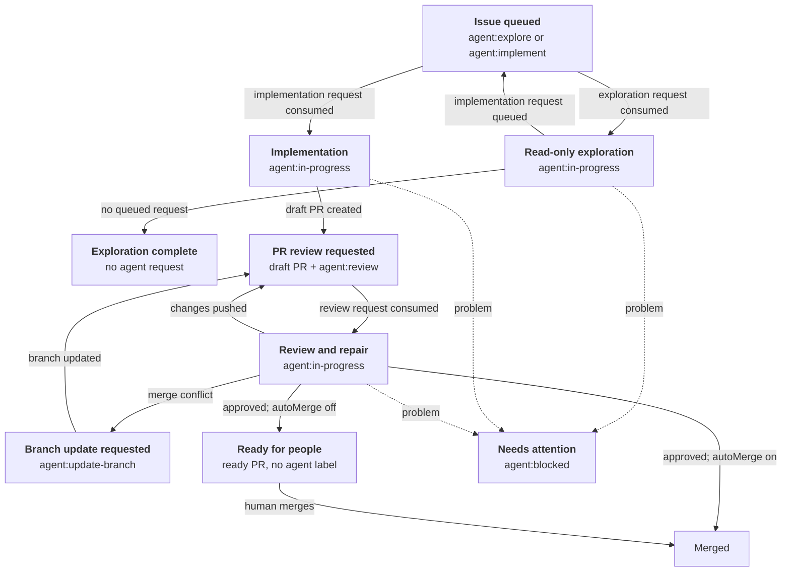

English | [日本語](README.ja.md)

# deadloop

> Build your loop. deadloop runs it. Maximum effort.

**GitHub Issues in, reviewed PRs out.** deadloop watches Issues and automates implementation, pull requests, review, and merge—with safety controls built in.

## Install

Install the Pi package:

```bash
pi install git:github.com/yasuhito/deadloop
```

This installs the deadloop extension and its setup skill together.

## Current status

- v0 is a Pi package / extension.
- The automation host can be either Pi or [omp](https://github.com/oh-my-pi/pi-coding-agent) (Oh My Pi); the package loads and drives automations under both with no host-specific setting. One host serves a repository at a time: the scheduler lock is scoped to the GitHub repository ID, so a second host of either kind leaves the first one driving.
- Workers and reviewers run `pi`, `claude`, or `omp`, chosen with `workerAgent` and `reviewerAgent` independently of which host runs the automations.
- The default runner is [Herdr](https://herdr.dev/).
- The supported host platform currently requires a Unix-like system with a compatible `flock` executable (normally provided by util-linux) and nonblocking file-descriptor locks. `/deadloop-enable` verifies this capability before enabling automation.
- Each Automation host fixes the deadloop checkout commit as its code identity when the extension loads. If the checkout advances, the host reloads itself at the next idle tick boundary (`/deadloop-reload`, once per deployed commit) and continues on the new code; if that reload does not take, shared enablement writes and scheduler ticks stop, and status and doctor show both identities and the recovery step. The host never pulls its own checkout; advancing `main` is the operator's step. The shared enablement state records the last writer's code identity for diagnosis only, and `/deadloop-doctor` reports it together with the code snapshot inventory (generations and capacity) plus cleanup commands; snapshots are never removed automatically. A retained attempt's completion (verification, push, PR, persistence, closure) runs from the code the host currently loads, so a deployed fix reaches attempts that were already in flight at the next tick (ADR 0036).

## Configure

You need an authenticated `gh` CLI and a running [Herdr](https://herdr.dev/) 0.8.0 or newer server.

1. Start Pi from the repository's normal Git checkout:

   ```bash
   cd /absolute/path/to/your/repo
   pi
   ```

2. Enable deadloop:

   ```text
   /deadloop-enable
   ```

3. Add `agent:implement` to request implementation, or `agent:explore` to request a read-only investigation. `ready-for-agent` remains optional triage metadata. When both requests are present, exploration runs first and its result is posted to the Issue before implementation starts.

That is enough to start. Enablement is a fast control-plane check: it resolves the required-verification contract but does not run repository tests, and it creates any missing standard labels with automatic merge off. Repository tests still run as required verification before deadloop pushes, hands off, or merges a produced revision. The default verification command is `npm run check`; if the repository does not provide that script, set a different `checkCommand` in `deadloop.json` as described in [Advanced configuration](#advanced-configuration).

If a deterministic enablement operation itself fails because local storage ran out (`ENOSPC` or `EDQUOT`), the command reports that capacity stop and keeps a small local evidence file; `/deadloop-doctor` shows it until the next successful enablement. The stop records no execution permission and touches no GitHub issue, pull request, or agent workflow label — fix storage, then run `/deadloop-enable` again.

## Control the loop with labels

You start the loop by labeling an Issue. deadloop owns the exploration, implementation, and review transitions, then either hands the approved PR to a human or merges it according to policy.



1. **Request work** — `agent:explore` requests a read-only investigation and takes priority over `agent:implement`; `agent:implement` requests implementation. `ready-for-agent` is optional triage metadata. Remove a request label before deadloop consumes its selected generation to cancel it.
2. **Let deadloop work** — deadloop durably records the attempt, then consumes only the selected request and creates `agent:in-progress` as one proven transition before it starts the explorer or Worker. One Issue runs one attempt, and exploration wins: if exploration and implementation are consumed at the same moment, only exploration starts and `agent:implement` is put back, so implementation stays queued for the attempt after the exploration result is available; a comment explains it and nothing is needed from you. A successful exploration posts its result without erasing a queued implementation request. Implementation creates a draft PR with `agent:review` and repeats review and repair as needed. Pull request work is queued only by request labels, consumed one at a time in the order `agent:update-branch`, `agent:implement`, `agent:review`.
3. **Finish or intervene** — An approved PR becomes ready and keeps no agent workflow label when automatic merge is off, or is merged when it is on. `ready-for-human` is an Issue triage label and is never added to a PR. `agent:blocked` stops the loop when deadloop needs help. A failed or unsafe exploration clears requests that predate its block; a request added after the block remains the recovery interface. Most stopped PRs keep no agent request; a required-verification stop keeps `agent:review` only to identify the review target, but its request event predates the block and cannot restart work. Fix the reported cause, then use `/deadloop-doctor` after required verification resolves or add the request label for the role you want next. `agent:blocked` clears when that attempt starts.
4. **Declare dependencies in the Issue body** — A `## Blocked by` (or `Depends on`) section gates selection: a bare `#123` or a link naming this repository blocks until its Issue closes, and a number that does not exist here also blocks (fail closed) with an explanatory comment on the Issue. References to another repository's Issues — links or `owner/repo#123` — are ignored, because deadloop works per repository.

## Operator commands

Run these commands from the Pi session in the target repository:

| Command | Purpose |
| --- | --- |
| `/deadloop-enable` | Run fast prerequisite checks and enable new deadloop work. |
| `/deadloop-disable` | Stop new work from starting; running attempts may finish. |
| `/deadloop-run-once` | Run exactly one normal scheduler tick while scheduling stays disabled; no later tick is scheduled. |
| `/deadloop-status` | Show whether deadloop is enabled and summarize its current state. |
| `/deadloop-doctor` | Diagnose configuration and retained attempts without changing them. |
| `/deadloop-usage [attempt-id]` | Show normalized model usage for the last 7 days by role and model; with an attempt id, show its response-level detail. |
| `/deadloop-abandon-attempt <attempt-id>` | Safely abandon a retained attempt only when doctor presents this command. |

## Advanced configuration

The default verification command is `npm run check`. To use another command, commit `deadloop.json` to the repository's base branch:

```json
{
  "checkCommand": "your verification command"
}
```

The same `deadloop.json` may also declare one complete CI-equivalent verification command that deadloop runs against the prospective merge tree when GitHub checks fail (see [Safety controls](#safety-controls)):

```json
{
  "ciEquivalentCommand": "your full CI-equivalent command"
}
```

Without it, a trusted-base `package-lock.json` plus a `package.json` `scripts.check` entry establishes the convention `npm ci && npm run check`; otherwise CI fallback verification stays unavailable.

The default setup does not require a local configuration file. Create one only when you need overrides such as `autoMerge`, a custom `worktreeRoot`, or additional trusted automation hosts:

```bash
mkdir -p ~/.pi/agent/deadloop
cp ~/.pi/agent/git/github.com/yasuhito/deadloop/extensions/deadloop/projects.example.json ~/.pi/agent/deadloop/projects.json
$EDITOR ~/.pi/agent/deadloop/projects.json
```

`projects.json` contains local paths and rollout choices. Do not commit it. Prefer the repository-owned `deadloop.json` for shared, reviewable policy.

### Role models

Each role launches with an explicit model, so no launch ever falls back to the agent CLI default:

- `workerModel` and `reviewerModel` are required in `projects.json`. deadloop refuses to enable or launch without them.
- `explorerModel`, `repairModel`, and `branchUpdateModel` are optional; each inherits `workerModel` when omitted.
- The repository-owned `deadloop.json` may supply any of these values for shared policy; local settings win.

Every launch records which model it started, and status shows the resolved per-role models.

### Model usage records

deadloop normalizes every traceable model response — the parent agent, sub-agents, and advisors — into one record with attempt identity, role, provider, model, input/cache-read/cache-write/output/reasoning/total tokens, duration, stop reason, error presence, timestamp, and an estimated cost. Records are collected after the turn ends and before workspace closure, deduplicated by stable session/response identity, and stored in deadloop's state directory for the same retention period as attempt evidence. Prompt and response bodies are never copied.

- Missing measurements appear as `unknown`, never as zero; usage that cannot be proven to belong to an attempt is counted as `unattributed`.
- Collection is observational: a telemetry failure is recorded but never undoes a completion, push, handoff, or merge.
- There is no token ceiling; measurements exist so operators can tune model policy after real operation. The estimated cost is deadloop's estimate from session metadata, not a provider invoice.
- Status shows current-attempt usage totals; `/deadloop-usage` reports the last 7 days by role and provider/model, or one attempt in detail.

If an implementation Issue reaches a required-verification block, deadloop preserves unrelated triage labels, removes the implementation request or in-progress state, and adds `agent:blocked` with reason-specific recovery guidance. It suppresses duplicate guidance for the same recovery, does not resume merely because configuration changes, and shows that Issue's requeue command in `/deadloop-doctor` only after required verification resolves.

A review stopped by required verification records actionable findings without launching repair, never records a finding-free result as approved, keeps `agent:review`, removes `agent:in-progress`, and adds `agent:blocked` without adding `ready-for-human`. The same recovery fingerprint suppresses duplicate stop comments. Configuration changes alone do not requeue the PR; after required verification resolves, `/deadloop-doctor` shows the PR-specific command that creates a new review request event.

### Host activity log

Every scheduler tick appends what it judged to `~/.pi/agent/deadloop/host-log.jsonl`, one JSON object per line: tick starts, per-automation results (including the driver action), launched attempts with their role, model-wait transitions, and enablement writes. Each line carries an ISO timestamp, project id, automation id, result, and reason summary, so you can answer "why did nothing happen this tick?" or "when was what selected?" without reading live state.

Logging is observational: a failed append is recorded beside the log in `host-log-errors.jsonl` and never affects completion, push, merge, or the tick itself.

- Tail it from Pi: `/deadloop-hostlog [N]` shows the last N entries (default 20).
- Read it directly: `tail -n 20 ~/.pi/agent/deadloop/host-log.jsonl | jq .` — one machine-readable object per line.

## Workflow state lives on GitHub

The Issue / PR state, head revision, labels, comments, and checks are the only workflow state. Request labels (`agent:explore`, `agent:implement`, `agent:review`, `agent:update-branch`) are one-shot events: each labeled event asks for one attempt of that role, deadloop consumes it by removing exactly that label before starting work, and adding the same label again is the only way to retry or queue more work. `agent:in-progress` marks consumed work in motion, `agent:blocked` marks a stop, and neither is combined with a waiting request left behind by the stop.

One host serves a repository at a time through a repository-ID-scoped file lock; several machines or identities may share one repository because ownership is derived from the same public timeline, so every host reaches the same conclusion about which attempt owns the work. If an attempt times out, its host dies, or reconciliation cannot prove safety, the target lands on `agent:blocked` with a readable reason — nothing restarts on its own until someone adds a fresh request label. `/deadloop-doctor` prints that exact command instead of local recovery steps.

This model follows Matt Pocock's Sandcastle dogfood workflows (research notes in [docs/research/matt-pocock-sandcastle-github-state-model.md](docs/research/matt-pocock-sandcastle-github-state-model.md)). Deadloop keeps its own safety differences on purpose: non-force pushes bound to the exact verified head, required verification before push, handoff, or merge, per-tick stale reconciliation, and distributed claims across hosts. See [ADR 0032](docs/adr/0032-github-is-the-workflow-state-source-of-truth.md) for the decision.

## Safety controls

`autoMerge` controls whether deadloop merges reviewed PRs automatically.

With `false`, deadloop creates and reviews each PR, then hands the merge to a human.

With `true`, deadloop squash-merges PRs that pass its safety checks and deletes their head branches.

GitHub checks are one health signal, never the sole authority. Missing checks are not failures, pending checks are waited on, and unknown check states stop the merge. After every check finishes with at least one failure, automatic merge continues only if the repository's complete CI-equivalent verification command passes on the exact prospective merge tree of the current head and base. That result is recorded as CI fallback success — never as CI success — bound to the head, base, resulting tree, resolved command, and trusted-base policy revision; any of these changing invalidates it. A failed fallback first diagnoses the fixed trusted base with the same command: a failing base blocks all agent launches without consuming Agent requests until the base or contract changes, while a healthy base allows exactly one repair through the existing review-repair path per episode; a second fallback failure stops for a human. deadloop only performs normal GitHub merges and never uses admin or ruleset bypass; branch protection remains authoritative.

Reviewers can still report requested changes or a required human decision when required verification is missing or failing. Approval, successful human handoff, and merge consideration require a host-recorded successful required-verification result for the current PR head; agent-reported validations remain additional evidence only.

Start with `false`. Enable `true` only after verifying branch protection, CI, permissions, and stop conditions.

Issue implementation Workers, explorers, PR reviewers, review-repair workers, and branch-update attempts are monitored deterministically without using the Automation host's model. Runtime-reported working status wins over quiet output, the configured 24-hour limit applies to active work, and a terminal attempt without a valid completion report is never prompted or nudged through conversation. A Worker completion report runs the required verification, destination-bound push, draft PR creation with review request, and attempt persistence as one deterministic chain; an explorer result is validated and persisted with its next Issue action.

A Worker whose monitoring was lost after it filed a completion report is not stranded either: once no pending handoff remains and the runtime stops reporting active work, reconciliation collects the bound report through the same deterministic chain — push and draft PR included when the local branch survives. If the report no longer proves its binding to the attempt's target revision, the Issue gets one reasoned `agent:blocked` stop with manual recovery steps instead of a dangling claim; the retained branch and journal are left as evidence.

When the runtime confirms a stopped review, stopped repair, or stopped branch update, deadloop re-reads its completion report once more before recording anything, and publishes the stop on the PR bound to the attempt — for a repair, to its review-finding contract key; for a branch update, to the base head it was selected against — and the exact head selected for the work. A stop whose report file itself could not be read because of `ENOSPC` or `EDQUOT` is recorded as a capacity stop with free-storage recovery steps; pane output alone never names that cause. Both failure classes skip the bounded technical retry and never retry automatically. A person restarts a stopped repair by adding `agent:implement`, or a stopped branch update by adding `agent:update-branch`: deadloop relaunches only what the published marker and retained journal still prove — the findings contract for a repair, the same head/base pair plus retained mid-merge checkout for an update — and only while no other agent occupies the stopped workspace.

A terminal turn whose evidence matches only a known billing or access rejection pauses the attempt instead of stopping it: deadloop posts one idempotent GitHub explanation, keeps the same attempt, workspace, worktree, pane, and agent session, and excludes the waiting time from active-work accounting. A provider-stated retry time gates the retry; without one, the normal next scheduler tick is the only retry trigger, and each retry sends one fixed continuation prompt to the same agent session with no Automation-host model calls. Status reports the retry count, waiting start, waiting duration, next retry time, and active-work duration separately.

## Merge-conflict recovery

deadloop detects merge conflicts during review and turns them into `agent:update-branch` requests instead of recovering from local state. A later cycle consumes that request and launches a branch-update worker; when the pushed head makes the request obsolete, it is consumed with an explanation and the PR returns to normal review.

The worker merges the selected base commit into the existing PR branch. It never rebases.

The worker must produce a passed record bound to its fixed required-verification contract and output commit. It atomically updates the branch only if the PR head still equals the validated commit, then returns the PR to normal review.

Review labels remain in place during the update. No extra label is required.

Each exact PR-head/base-head pair is attempted at most once.

A stale PR head stops the update without pushing. deadloop re-evaluates the PR on the next cycle.

A failed or unsafe update adds `agent:blocked` with recovery evidence and leaves no agent request waiting.

See [ADR 0011](docs/adr/0011-pr-merge-conflict-recovery.md) for the safety contract.

## Automatic review repair

When the built-in reviewer reports structured required findings and confirms repair progress from the complete review history, deadloop can start one bounded repair worker for that review result on the existing PR branch. A review is approved only when it has no required findings; it may still include advisory observations, which are shown to people and never sent for automatic repair.

During repair, deadloop preserves `agent:in-progress` without adding another workflow label. It does not create a new `agent:review` request generation until repair completion.

The worker receives only the findings.

The finalizer runs required verification for every repair, regardless of how many files changed. It requires a passed record bound to the attempt's fixed required-verification contract and repair commit, and reuses only a fully matching record. There is no cumulative repair-count or changed-file-count stopping rule: a fourth or later repair remains eligible when every earlier required finding is resolved and the current required findings are new. It atomically updates the exact branch only if the branch head still equals the validated commit.

The finalizer never replaces another head or changes GitHub workflow state.

The review result appears in a human-readable PR comment. Comments identify the reviewed commit, reasons, required findings, advisory observations, and next action without displaying finding IDs. Review and repair comments are chronological and append-only: deadloop never edits a posted comment, and a correction is posted as a new comment.

Each review is also bound to a complete, paginated observation of the PR's commit sequence, exact diff, conversation comments, submitted reviews, and inline review comments. Any addition, edit, deletion, head/base change, or diff change discards the stale result and returns the PR to a fresh review request instead of allowing stale approval or repair. Comment and review text is untrusted evidence, not an instruction or permission to weaken required verification, exact-head checks, non-force push, or another safety control.

After a confirmed repair push, deadloop adds a separate result comment. This comment records the changes for each finding, the new commit, the checks, and the handoff to re-review.

A stale or failed repair never receives a success comment.

A changed head starts a fresh review cycle.

A stale head stops the repair without pushing or changing labels.

If an earlier required finding persists, a resolved finding regresses, or earlier and new required findings are mixed, deadloop starts no repair and hands the completed review to a person. Technical or safety retries that are exhausted still add `agent:blocked` with recovery guidance and clear every request label; a blocked report naming an observed `ENOSPC` or `EDQUOT` stops without spending a retry, and its guidance points at freeing host capacity before adding a new request. A human-required result is recorded, the draft becomes ready, and every agent workflow label is removed, so the PR waits on a person and on no agent request.

Required-verification failure still blocks a repair push. A stale head stops without push or label mutation, and the finalizer updates only the exact verified branch through a push bound to the verified head by an expected-object-ID lease; because the repair commit must contain that head, the lease can only fast-forward.

See [ADR 0031](docs/adr/0031-review-history-based-repair-progress.md) for the current decision and superseded [ADR 0012](docs/adr/0012-automatic-pr-review-repair.md) for the historical quantitative policy.

## Roll out in phases

1. **Issue coordination only** — Start here for a slow rollout. Humans still review and merge PRs.
2. **Automated PR review** — Use the standard PR reviewer with `autoMerge: false`. Approved PRs become ready with no agent workflow label left, so people take them from there. External-review mutations are currently unavailable; enabling `externalReview` does not make them available.
3. **Optional auto-merge** — Consider `autoMerge: true` only after proving branch protection, CI, review expectations, dry-run or manual approval practices, and stop conditions.

## Documentation

- Herdr runner details: [docs/herdr-runner.md](docs/herdr-runner.md)

## Verify this repository

The executable acceptance specification lives in [`acceptance/features/`](acceptance/features/).

Run Vitest or Cucumber independently when investigating a failure. `npm test` always runs both serially.

```bash
npm run test:unit
npm run test:acceptance
npm test
npm run lint
npm run typecheck
npm pack --dry-run
npm run check
```
