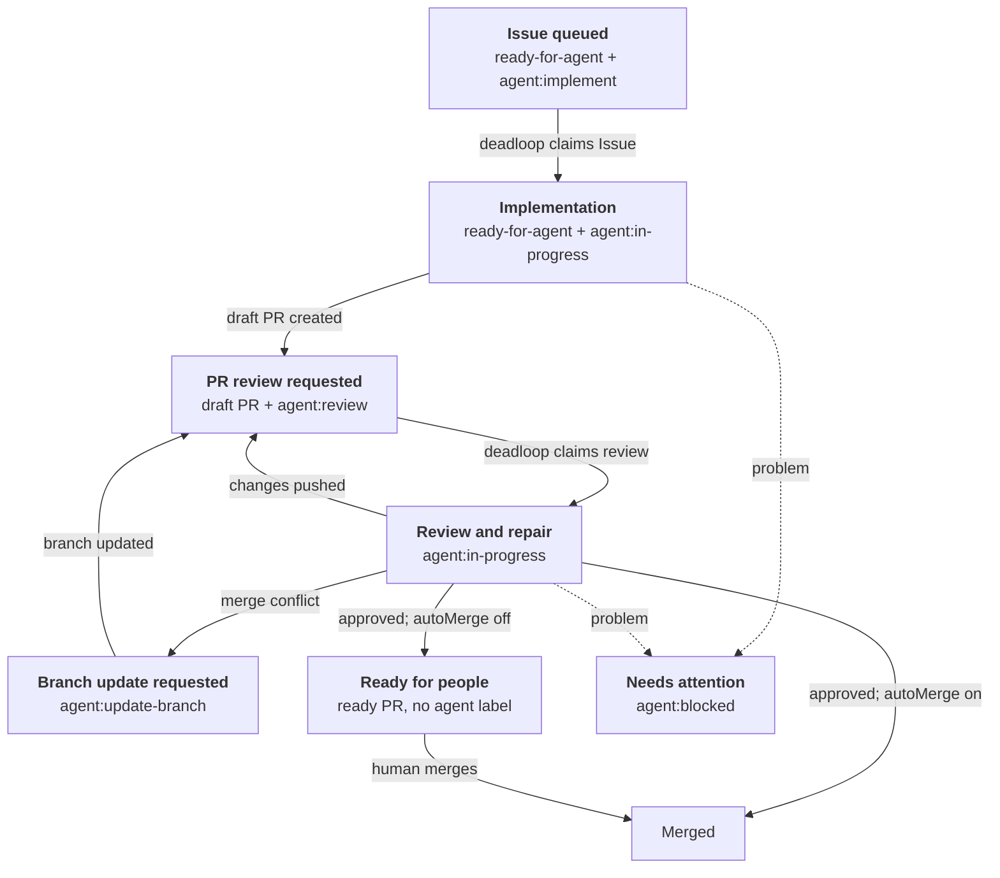

English | [日本語](README.ja.md)

# deadloop

> Build your loop. deadloop runs it. Maximum effort.

**GitHub Issues in, reviewed PRs out.** deadloop watches Issues and automates implementation, pull requests, review, and merge—with safety controls built in.

## Install

Install the Pi package:

```bash
pi install git:github.com/yasuhito/deadloop
```

This installs the deadloop extension and its setup skill together.

## Current status

- v0 is a Pi package / extension.
- The default runner is [Herdr](https://herdr.dev/).
- The supported host platform currently requires a Unix-like system with a compatible `flock` executable (normally provided by util-linux) and nonblocking file-descriptor locks. `/deadloop-enable` verifies this capability before enabling automation.

## Configure

You need an authenticated `gh` CLI and a running [Herdr](https://herdr.dev/) 0.8.0 or newer server.

1. Start Pi from the repository's normal Git checkout:

   ```bash
   cd /absolute/path/to/your/repo
   pi
   ```

2. Enable deadloop:

   ```text
   /deadloop-enable
   ```

3. To send an Issue to deadloop, add both labels:

   - `ready-for-agent`
   - `agent:implement`

That is enough to start. During enablement, deadloop runs `npm run check`, creates any missing standard labels, and leaves automatic merge off. If the repository does not provide an `npm run check` script, set a different `checkCommand` in `deadloop.json` as described in [Advanced configuration](#advanced-configuration).

## Control the loop with labels

You start the loop by labeling an Issue. deadloop owns the implementation and review transitions, then either hands the approved PR to a human or merges it according to policy.



1. **Request implementation** — `ready-for-agent` marks an Issue as eligible. `agent:implement` requests implementation. Remove `agent:implement` before deadloop claims the Issue to cancel the request.
2. **Let deadloop work** — deadloop replaces the request label with `agent:in-progress`, creates a draft PR with `agent:review`, and repeats review and repair as needed. Pull request work is queued only by request labels, consumed one at a time in the order `agent:update-branch`, `agent:implement`, `agent:review`.
3. **Finish or intervene** — An approved PR becomes ready and keeps no agent workflow label when automatic merge is off, or is merged when it is on. `ready-for-human` is an Issue triage label and is never added to a PR. `agent:blocked` stops the loop when deadloop needs help, and a stopped PR keeps no agent request; fix the cause reported in the Issue or PR comment, then add the request label for the role you want next. `agent:blocked` clears when that attempt starts.

## Operator commands

Run these commands from the Pi session in the target repository:

| Command | Purpose |
| --- | --- |
| `/deadloop-enable` | Verify the repository and enable new deadloop work. |
| `/deadloop-disable` | Stop new work from starting; running attempts may finish. |
| `/deadloop-status` | Show whether deadloop is enabled and summarize its current state. |
| `/deadloop-doctor` | Diagnose configuration and retained attempts without changing them. |
| `/deadloop-abandon-attempt <attempt-id>` | Safely abandon a retained attempt only when doctor presents this command. |

## Advanced configuration

The default verification command is `npm run check`. To use another command, commit `deadloop.json` to the repository's base branch:

```json
{
  "checkCommand": "your verification command"
}
```

The default setup does not require a local configuration file. Create one only when you need overrides such as `autoMerge`, a custom `worktreeRoot`, or additional trusted automation hosts:

```bash
mkdir -p ~/.pi/agent/deadloop
cp ~/.pi/agent/git/github.com/yasuhito/deadloop/extensions/deadloop/projects.example.json ~/.pi/agent/deadloop/projects.json
$EDITOR ~/.pi/agent/deadloop/projects.json
```

`projects.json` contains local paths and rollout choices. Do not commit it. Prefer the repository-owned `deadloop.json` for shared, reviewable policy.

If an implementation Issue reaches a required-verification block, deadloop keeps `ready-for-agent`, removes the implementation claim, and adds `agent:blocked` with reason-specific recovery guidance. It suppresses duplicate guidance for the same recovery, does not resume merely because configuration changes, and shows that Issue's requeue command in `/deadloop-doctor` only after required verification resolves.

## Safety controls

`autoMerge` controls whether deadloop merges reviewed PRs automatically.

With `false`, deadloop creates and reviews each PR, then hands the merge to a human.

With `true`, deadloop squash-merges PRs that pass its safety checks and deletes their head branches.

Start with `false`. Enable `true` only after verifying branch protection, CI, permissions, and stop conditions.

## Merge-conflict recovery

Automatic branch updates are currently unavailable. deadloop detects merge conflicts but does not update the branch until #241 connects the `agent:update-branch` request to its worker. The existing non-force, exact-head, required-verification, and normal-merge safety contracts remain required.

The behavior below describes the safety contract for that future connection, not behavior that can currently run.

The worker merges the selected base commit into the existing PR branch. It never rebases.

The worker runs the configured checks. It atomically updates the branch only if the PR head still equals the validated commit, then returns the PR to normal review.

Review labels remain in place during the update. No extra label is required.

Each exact PR-head/base-head pair is attempted at most once.

A stale PR head stops the update without pushing. deadloop re-evaluates the PR on the next cycle.

A failed or unsafe update adds `agent:blocked` with recovery evidence and leaves no agent request waiting.

See [ADR 0011](docs/adr/0011-pr-merge-conflict-recovery.md) for the safety contract.

## Automatic review repair

When the built-in reviewer reports structured actionable findings, deadloop can start one bounded repair worker on the existing PR branch.

During repair, deadloop preserves `agent:in-progress` without adding another workflow label. It does not create a new `agent:review` request generation until repair completion.

The worker receives only the findings.

The finalizer runs the configured checks for every repair, regardless of how many files changed. It atomically updates the exact branch only if the branch head still equals the validated commit.

The finalizer never replaces another head or changes GitHub workflow state.

The review result appears in a readable PR comment. The comment identifies the reviewed commit, reasons, findings, and next action.

Each review is also bound to a complete, paginated observation of the PR's commit sequence, exact diff, conversation comments, submitted reviews, and inline review comments. Any addition, edit, deletion, head/base change, or diff change returns the PR to a fresh review request; comment text is treated only as untrusted evidence.

After a confirmed repair push, deadloop adds a separate result comment. This comment records the changes for each finding, the new commit, the checks, and the handoff to re-review.

A stale or failed repair never receives a success comment.

A changed head starts a fresh review cycle.

A stale head stops the repair without pushing or changing labels.

Repeated findings after the bounded attempt add `agent:blocked` with recovery guidance and clear every request label, and deadloop does the same when technical or safety retries are exhausted. A review that reports a human decision is a completed review: its result is recorded, the draft becomes ready, and every agent workflow label is removed, so the PR waits on a person and on no agent request.

See [ADR 0012](docs/adr/0012-automatic-pr-review-repair.md) for details.

## Roll out in phases

1. **Issue coordination only** — Start here for a slow rollout. Humans still review and merge PRs.
2. **Automated PR review** — Use the standard PR reviewer with `autoMerge: false`. Approved PRs become ready with no agent workflow label left, so people take them from there. External-review mutations are currently unavailable; enabling `externalReview` does not make them available.
3. **Optional auto-merge** — Consider `autoMerge: true` only after proving branch protection, CI, review expectations, dry-run or manual approval practices, and stop conditions.

## Documentation

- Herdr runner details: [docs/herdr-runner.md](docs/herdr-runner.md)

## Verify this repository

The executable acceptance specification lives in [`acceptance/features/`](acceptance/features/).

Run Vitest or Cucumber independently when investigating a failure. `npm test` always runs both serially.

```bash
npm run test:unit
npm run test:acceptance
npm test
npm run lint
npm run typecheck
bash -n extensions/deadloop/automations/*.sh
npm pack --dry-run
npm run check
```
